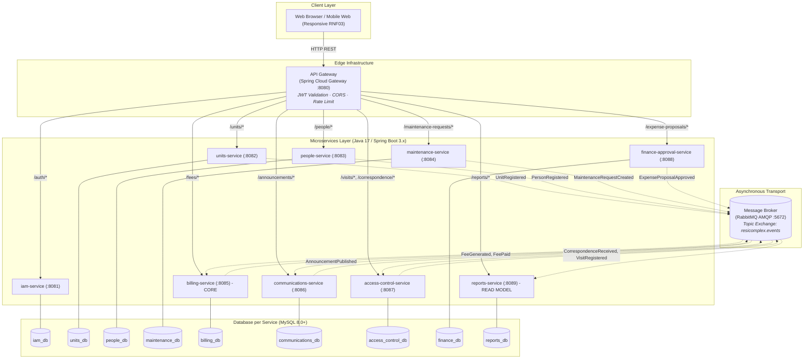

# Technical Architecture Formalization & Infrastructure Specifications: resi-complex

> **Document Status:** Formal Architecture Deliverable  
> **Target Project:** resi-complex (Integrated Residential and Commercial Management System)  
> **Language Standard Compliance:** Complies with `ADR-001` (English for technical documentation & code specifications).

---

## Document Index & File Location Map

| Artifact / Component | Target Repository Path | Description |
| :--- | :--- | :--- |
| **ADR-003** | `05-architecture/decisions/records/ADR-003-architectural-style.md` | Decision record for Microservices + Event-Driven style |
| **ADR-004** | `05-architecture/decisions/records/ADR-004-database-per-service.md` | Decision record for Database per Service pattern |
| **ADR-005** | `05-architecture/decisions/records/ADR-005-message-broker-selection.md` | Decision record for Message Broker selection (RabbitMQ) |
| **ADR-006** | `05-architecture/decisions/records/ADR-006-jwt-authentication-strategy.md` | Decision record for JWT Auth & API Gateway Strategy |
| **ADR Register Update** | `05-architecture/decisions/README.md` | Updated table of Architecture Decision Records |
| **Infrastructure Def.** | `05-architecture/overview.md` & `05-architecture/deployment.md` | Resolutions for AT-001 (Gateway), AT-002 (Broker), AT-003 (Orchestration) |
| **Outbox Pattern Spec** | `05-architecture/pattern-guide.md` & `06-data/models.md` | Transactional Outbox SQL schema and Spring Boot implementation guide |
| **Standard Error Schema** | `07-api/contracts/openapi/_shared.yaml` | OpenAPI 3.0 YAML definition for unified `ErrorResponse` (RFC 7807) |

---

## Part 1: Architecture Decision Records (ADRs)

### 1.1 ADR-003: Microservices + Event-Driven Architectural Style

```markdown
# ADR-003 — Microservices + Event-Driven Architectural Style

| Field | Value |
| :--- | :--- |
| **ID** | ADR-003 |
| **Date** | 2026-09-17 |
| **Status** | Accepted |
| **Authors** | Fabian Trujillo — Project Leader |
| **Reviewers** | Tech Lead, Development Team |
| **Supersedes** | N/A |

---

#### Context
The `resi-complex` system manages mixed-use residential complexes in Colombia, containing both residential housing units and commercial establishments. The system comprises 9 distinct business domains: Identity & Access Management (IAM), Units Management, People Management, Maintenance, Billing, Communications, Access Control, Financial Approval, and Reports.

Core domain analysis reveals that Billing and Units Management carry the primary competitive differentiator (differentiated fee rates for residential vs. commercial units). Furthermore, operational flows require decoupled, asynchronous reactions (e.g., notifying residents when fees are generated or when urgent maintenance requests are created).

**Known Constraints:**
- Strict domain boundaries identified during DDD analysis (9 Bounded Contexts).
- Java 17+ and Spring Boot 3.x stack requirement.
- Formative project delivery constraints requiring independent testability and clear team task allocation.

---

#### Decision
**We decided:** To adopt a **Microservices + Event-Driven Architectural Style**, deploying each of the 9 Bounded Contexts as an autonomous, independently deployable microservice communicating synchronously via REST APIs for direct queries and asynchronously via Domain Events for state changes and reactive business policies.

**Justification:** 
1. **Domain Alignment:** Directly mirrors the 9 Bounded Contexts defined in `02-domain/domain-map.md`.
2. **Independent Investment:** Allows heavy development and testing focus on Core Domains (`billing-service`, `units-service`) without risking regressions in generic domains (`iam-service`, `reports-service`).
3. **Asynchronous Decoupling:** Naturally supports the 16 domain events and reactive policies defined in `02-domain/domain-events.md`.

---

#### Evaluated Alternatives

| Alternative | Pros | Cons | Reason for Discarding |
| :--- | :--- | :--- | :--- |
| **Option A: Microservices + Event-Driven (CHOSEN)** | Clear domain isolation; independent scaling and deployment; matches domain events model natively. | Operational overhead of multiple services and event broker management. | — (Chosen) |
| **Option B: Monolithic Architecture** | Simple single-process deployment; trivial local execution. | Tightly couples core and generic domains; shared database risks domain boundary leakage; fails to demonstrate microservice competencies. | Violates DDD domain separation; hampers independent service scaling and team parallelization. |
| **Option C: Modular Monolith** | In-process module boundaries with lower deployment complexity. | Shared database temptation; lacks physical enforcement of network boundaries and asynchronous messaging patterns. | Does not satisfy requirement for independent deployment and event-driven microservice demonstration. |

---

#### Consequences
**Positive:**
- Enforces strict encapsulation between the 9 Bounded Contexts.
- Enables asynchronous execution of cross-service policies (e.g., fee notifications, maintenance alerts).
- Facilitates parallel development across team members using clear contract boundaries.

**Negative / Trade-offs:**
- Requires managing an API Gateway, Message Broker, and multiple service configurations.
- Introduces eventual consistency between services (handled via reactive domain event consumers).

**Impact on the System:**
- Affected Services: All 9 microservices (`iam-service`, `units-service`, `people-service`, `maintenance-service`, `billing-service`, `communications-service`, `access-control-service`, `finance-approval-service`, `reports-service`).
- Documents Updated: `05-architecture/overview.md`, `09-microservices/service-catalog.md`.

---

#### Risks

| Risk | Probability | Impact | Mitigation |
| :--- | :--- | :--- | :--- |
| Distributed system complexity overwhelming local setup | Medium | High | Provide a unified `docker-compose.yml` for local environment orchestration. |
| Event loss during service failures | Medium | High | Implement the Transactional Outbox Pattern in producing services. |

---

#### References
- DDD Bounded Contexts → `02-domain/domain-map.md`
- Domain Events Catalog → `02-domain/domain-events.md`
```

---

### 1.2 ADR-004: Database per Service Pattern

```markdown
# ADR-004 — Database per Service Pattern

| Field | Value |
| :--- | :--- |
| **ID** | ADR-004 |
| **Date** | 2026-09-17 |
| **Status** | Accepted |
| **Authors** | Fabian Trujillo — Project Leader |
| **Reviewers** | Tech Lead, Development Team |
| **Supersedes** | N/A |

---

#### Context
In microservice architectures, data management is a critical design choice. Allowing multiple microservices to access a single shared database creates tight coupling at the data layer, causes schema refactoring friction, and allows developers to bypass domain APIs using SQL `JOIN`s across service boundaries.

**Known Constraints:**
- MySQL 8.0+ is the locked database engine for `resi-complex`.
- Strict data privacy constraints under Colombian Ley 1581 de 2012 (Habeas Data) require isolating sensitive personal data in `people-service`.

---

#### Decision
**We decided:** To enforce the **Database per Service** pattern. Each of the 9 microservices owns its own dedicated MySQL database instance/schema (`iam_db`, `units_db`, `people_db`, `maintenance_db`, `billing_db`, `communications_db`, `access_control_db`, `finance_db`, `reports_db`). Direct database access or cross-database SQL queries between microservices are strictly prohibited.

**Justification:**
1. **Autonomy & Independence:** Services can change schema and deploy migrations independently using Flyway.
2. **Domain Boundary Integrity:** Forces inter-service data exchange to occur strictly via REST APIs or Domain Events.
3. **Security & Compliance:** Restricts access to sensitive resident data (`people_db`) to the `people-service` container only.

---

#### Evaluated Alternatives

| Alternative | Pros | Cons | Reason for Discarding |
| :--- | :--- | :--- | :--- |
| **Option A: Database per Service (CHOSEN)** | Perfect isolation; independent schema migrations; zero database-level coupling. | Cannot perform cross-service SQL `JOIN`s; requires eventual consistency. | — (Chosen) |
| **Option B: Shared Single Database** | Easy cross-table `JOIN`s; single database management. | Complete coupling; schema changes in one service break others; violates microservice isolation. | Anti-pattern in microservices; destroys service autonomy. |
| **Option C: Shared Database Server with Logical Schemas** | Reduced database container footprint. | Shared CPU/RAM resources; risk of accidental cross-schema permissions. | Acceptable in local dev via logical MySQL databases, but logically treated as distinct DBs. |

---

#### Consequences
**Positive:**
- Schema changes in `units-service` (e.g., adding commercial fields) never break `billing-service`.
- Data model for each service remains clean and focused solely on its aggregate root.

**Negative / Trade-offs:**
- Cross-domain reporting requires an event-driven read model (`reports-service` subscribes to domain events to build projections).

**Impact on the System:**
- Affected Services: All 9 microservices.
- Documents Updated: `06-data/models.md`, `05-architecture/pattern-guide.md`.

---

#### References
- Data Models per Service → `06-data/models.md`
- Microservices Pattern Guide → `05-architecture/pattern-guide.md`
```

---

### 1.3 ADR-005: Message Broker Selection (RabbitMQ)

```markdown
# ADR-005 — Message Broker Selection (RabbitMQ)

| Field | Value |
| :--- | :--- |
| **ID** | ADR-005 |
| **Date** | 2026-09-17 |
| **Status** | Accepted |
| **Authors** | Fabian Trujillo — Project Leader |
| **Reviewers** | Tech Lead, Development Team |
| **Supersedes** | N/A (Resolves AT-002) |

---

#### Context
The `resi-complex` architecture relies on 16 domain events (e.g., `UnitRegistered`, `FeeGenerated`, `MaintenanceRequestCreated`, `CorrespondenceReceived`) to trigger asynchronous cross-context policies. To carry these event payloads reliably between microservices, a dedicated Message Broker is required.

**Known Constraints:**
- Must support publish-subscribe messaging with topic-based routing (`units.unit.registered`, `billing.fee.generated`, etc.).
- Must run efficiently in local Docker development environments with minimal resource consumption.
- Native integration with Java 17+ / Spring Boot 3.x (`spring-boot-starter-amqp`).

---

#### Decision
**We decided:** To select **RabbitMQ** (version 3.12+ with Management Plugin) using AMQP 0-9-1 as the official Message Broker for `resi-complex`. Events will be published to a single Topic Exchange named `resicomplex.events` with routing keys matching the domain event channels.

**Justification:**
1. **Flexible Topic Routing:** AMQP topic exchanges perfectly match the hierarchical routing keys used in our domain events catalog.
2. **Lightweight Footprint:** Low memory and CPU usage in Docker Compose compared to Kafka clusters.
3. **Built-in Queue Management:** Features native Dead Letter Queues (DLQ), message TTL, and a web management dashboard (`http://localhost:15672`).
4. **Spring Boot Ecosystem:** Flawless integration via `Spring AMQP` (`RabbitTemplate`, `@RabbitListener`).

---

#### Evaluated Alternatives

| Alternative | Pros | Cons | Reason for Discarding |
| :--- | :--- | :--- | :--- |
| **Option A: RabbitMQ (CHOSEN)** | Lightweight; native AMQP topic routing; DLQ support; low resource usage; excelente Spring integration. | Lower throughput limits compared to Kafka (irrelevant at residential complex scale). | — (Chosen) |
| **Option B: Apache Kafka** | Massive throughput; log replay capabilities. | High resource consumption (JVM + ZooKeeper/KRaft); steep setup complexity for local dev. | Over-engineered for single complex scale (< 500 RPS). |
| **Option C: Redis Streams** | Extremely fast; zero additional container if Redis is already used for caching. | Lacks native DLQ, sophisticated routing exchanges, and message acknowledgment management. | Lacks enterprise message broker features needed for auditability. |

---

#### Consequences
**Positive:**
- Fast local setup via standard `rabbitmq:3-management` Docker image.
- Out-of-the-box Dead Letter Exchanges for handling failed message retries.
- Web UI provides immediate visual debugging of queues and message rates.

**Negative / Trade-offs:**
- Message ordering across different queues is not guaranteed (mitigated by using `occurredAt` and `version` timestamps in event metadata).

**Impact on the System:**
- Affected Services: `units-service`, `people-service`, `maintenance-service`, `billing-service`, `communications-service`, `access-control-service`, `finance-approval-service`, `reports-service`.
- Documents Updated: `05-architecture/overview.md`, `02-domain/domain-events.md`.

---

#### References
- Domain Events Catalog & Topics → `02-domain/domain-events.md`
- Technical Debt AT-002 → `05-architecture/overview.md`
```

---

### 1.4 ADR-006: JWT-Based Authentication & API Gateway Strategy

```markdown
# ADR-006 — JWT Authentication & API Gateway Strategy

| Field | Value |
| :--- | :--- |
| **ID** | ADR-006 |
| **Date** | 2026-09-17 |
| **Status** | Accepted |
| **Authors** | Fabian Trujillo — Project Leader |
| **Reviewers** | Tech Lead, Development Team |
| **Supersedes** | N/A (Resolves AT-001) |

---

#### Context
`resi-complex` enforces Role-Based Access Control (RBAC) across 5 authentication roles (`ADMINISTRATOR`, `BOARD`, `PERSON`, `MAINTENANCE_STAFF`, `SECURITY_GUARD`) and Ownership-Level Authorization (`:own` / `:assigned`). Exposing 9 microservices directly to clients creates security vulnerabilities, CORS configuration nightmare, and duplicate JWT verification logic in every service.

**Known Constraints:**
- JWT access tokens must expire in **1 hour**; refresh tokens valid for **7 days** (per `NFR-004`).
- All incoming HTTP traffic must pass through a single entry point (API Gateway).
- Java 17+ and Spring Boot stack compatibility.

---

#### Decision
**We decided:** To deploy **Spring Cloud Gateway** (Port 8080) as the central API Gateway. 
1. **Authentication:** `iam-service` issues signed JWT tokens upon login (`POST /auth/login`).
2. **Centralized Gateway Validation:** Spring Cloud Gateway validates incoming JWT signature and expiration.
3. **Context Propagation:** Upon successful validation, the Gateway extracts JWT claims and forwards them to downstream microservices via trusted HTTP headers:
   - `X-User-Id`: User's UUID
   - `X-User-Roles`: User's primary role
   - `X-User-Permissions`: Comma-separated list of granted permissions
4. **Ownership Authorization:** Downstream services evaluate ownership (`:own`, `:assigned`) using the `X-User-Id` header against resource ownership.

---

#### Evaluated Alternatives

| Alternative | Pros | Cons | Reason for Discarding |
| :--- | :--- | :--- | :--- |
| **Option A: Spring Cloud Gateway + IAM JWT (CHOSEN)** | Single tech stack (Java/Spring); native Reactive Netty performance; seamless JWT claim propagation headers; centralized CORS. | Requires learning Spring WebFlux reactive routing syntax. | — (Chosen) |
| **Option B: Kong API Gateway (Community)** | High performance C/Lua gateway; rich plugin ecosystem. | Separate tech stack; heavier plugin configuration; extra operational learning curve for Java team. | Adds unnecessary multi-language complexity to a pure Java/Spring project. |
| **Option C: Direct Microservice Exposure** | No Gateway container needed. | Duplicate JWT verification in 9 services; CORS nightmare; security risk if a service omits auth. | Violates security best practices and `NFR-004`. |

---

#### Consequences
**Positive:**
- Centralized CORS, Rate Limiting, and SSL termination at Port 8080.
- Downstream microservices do not need complex JWT verification libraries—they read trusted `X-User-*` headers.
- Internal microservices are hidden behind the Gateway network alias in Docker.

**Negative / Trade-offs:**
- API Gateway becomes a single point of failure (mitigated in production via horizontal scaling).

**Impact on the System:**
- Affected Services: `api-gateway`, `iam-service`, and all 8 downstream services.
- Documents Updated: `05-architecture/overview.md`, `04-requirements/non-functional.md`.

---

#### References
- Security Policy & Permission Suffixes → `00-governance/security-policy.md`
- Non-Functional Security Requirements → `04-requirements/non-functional.md`
```

---

### 1.5 ADR Register Update (`05-architecture/decisions/README.md`)

```markdown
#### ADR Register

| # | Title | Status | Date |
| :--- | :--- | :--- | :--- |
| **ADR-001** | Documentation Language (English) | Accepted | 2026-08-28 |
| **ADR-002** | Language Exception for User-Research Artifacts | Accepted | 2026-09-16 |
| **ADR-003** | Microservices + Event-Driven Architectural Style | Accepted | 2026-09-17 |
| **ADR-004** | Database per Service Pattern | Accepted | 2026-09-17 |
| **ADR-005** | Message Broker Selection (RabbitMQ) | Accepted | 2026-09-17 |
| **ADR-006** | JWT Authentication & API Gateway Strategy | Accepted | 2026-09-17 |
```

---

## Part 2: Technical Debt Resolutions (AT-001, AT-002, AT-003)

### 2.1 Technical Debt Resolution Summary Table

| Debt ID | Concern | Selected Technology | Specification Summary | Target File |
| :--- | :--- | :--- | :--- | :--- |
| **AT-001** | API Gateway Selection | **Spring Cloud Gateway** (Port 8080) | Centralized entry point, JWT validation filter, CORS handling, routing to ports 8081-8089. | `05-architecture/overview.md` §2 |
| **AT-002** | Message Broker Selection | **RabbitMQ 3.12** (Ports 5672, 15672) | Topic Exchange `resicomplex.events` for 16 domain events, DLQ enabled, AMQP protocol. | `05-architecture/overview.md` §3 |
| **AT-003** | Container Orchestration | **Docker Compose** (Local MVP) | Multi-container setup containing Gateway, 9 Spring Boot apps, RabbitMQ, and 9 MySQL instances. | `05-architecture/deployment.md` |
| **AT-004** | Standard Error Schema | **RFC 7807 `ErrorResponse`** | Unified JSON error structure for all 4xx/5xx HTTP responses. | `07-api/contracts/openapi/_shared.yaml` |

---

### 2.2 System Container Topology (`05-architecture/overview.md`)



---

## Part 3: Transactional Outbox Pattern Implementation Guide

### 3.1 Outbox Table SQL Schema (`06-data/models.md`)

To guarantee **at-least-once delivery** of all 16 domain events without risking event loss during application crashes, every publishing microservice (`units-service`, `people-service`, `maintenance-service`, `billing-service`, `communications-service`, `access-control-service`, `finance-approval-service`) MUST include the following `outbox` table in its dedicated database schema:

```sql
-- Outbox table schema for transactional domain event publishing
CREATE TABLE outbox (
    id            VARCHAR(36)  PRIMARY KEY,
    event_id      VARCHAR(36)  NOT NULL UNIQUE,
    event_type    VARCHAR(100) NOT NULL,
    aggregate_type VARCHAR(100) NOT NULL,
    aggregate_id   VARCHAR(36)  NOT NULL,
    payload       JSON         NOT NULL,
    routing_key   VARCHAR(150) NOT NULL,
    status        VARCHAR(20)  NOT NULL DEFAULT 'PENDING', -- PENDING, PUBLISHED, FAILED
    retry_count   INT          NOT NULL DEFAULT 0,
    created_at    DATETIME(3)  NOT NULL DEFAULT CURRENT_TIMESTAMP(3),
    processed_at  DATETIME(3)  NULL,
    error_message TEXT         NULL,
    
    INDEX idx_outbox_status_created (status, created_at),
    INDEX idx_outbox_event_id (event_id)
) ENGINE=InnoDB DEFAULT CHARSET=utf8mb4 COLLATE=utf8mb4_unicode_ci;
```

---

### 3.2 Java Spring Boot Outbox Pattern Implementation

#### Step 1: Saving Aggregate + Outbox Record in the Same Transaction

```java
package com.resicomplex.billing.application.usecase;

import com.fasterxml.jackson.databind.ObjectMapper;
import com.resicomplex.billing.domain.model.AdministrationFee;
import com.resicomplex.billing.domain.port.out.AdministrationFeeRepository;
import com.resicomplex.billing.infrastructure.persistence.entity.OutboxJpaEntity;
import com.resicomplex.billing.infrastructure.persistence.repository.OutboxJpaRepository;
import org.springframework.stereotype.Service;
import org.springframework.transaction.annotation.Transactional;

import java.time.LocalDateTime;
import java.util.UUID;

@Service
public class GenerateFeeService {

    private final AdministrationFeeRepository feeRepository;
    private final OutboxJpaRepository outboxRepository;
    private final ObjectMapper objectMapper;

    public GenerateFeeService(AdministrationFeeRepository feeRepository, 
                              OutboxJpaRepository outboxRepository, 
                              ObjectMapper objectMapper) {
        this.feeRepository = feeRepository;
        this.outboxRepository = outboxRepository;
        this.objectMapper = objectMapper;
    }

    @Transactional
    public String generateFee(GenerateFeeCommand command) {
        // 1. Execute Domain Logic & Validate Invariants
        AdministrationFee fee = AdministrationFee.generate(
            command.unitId(), command.period(), command.unitType(), command.amount()
        );

        // 2. Save Aggregate Root to Service Database
        feeRepository.save(fee);

        // 3. Save Events to Outbox Table in the SAME Database Transaction
        fee.domainEvents().forEach(event -> {
            try {
                OutboxJpaEntity outboxEntry = new OutboxJpaEntity();
                outboxEntry.setId(UUID.randomUUID().toString());
                outboxEntry.setEventId(event.getEventId());
                outboxEntry.setEventType(event.getEventType());
                outboxEntry.setAggregateType("AdministrationFee");
                outboxEntry.setAggregateId(fee.getId());
                outboxEntry.setPayload(objectMapper.writeValueAsString(event));
                outboxEntry.setRoutingKey("billing.fee.generated");
                outboxEntry.setStatus("PENDING");
                outboxEntry.setCreatedAt(LocalDateTime.now());
                
                outboxRepository.save(outboxEntry);
            } catch (Exception e) {
                throw new RuntimeException("Failed to serialize domain event to outbox", e);
            }
        });

        fee.clearEvents();
        return fee.getId();
    }
}
```

#### Step 2: Background Poller & RabbitMQ Publisher

```java
package com.resicomplex.billing.infrastructure.messaging;

import com.resicomplex.billing.infrastructure.persistence.entity.OutboxJpaEntity;
import com.resicomplex.billing.infrastructure.persistence.repository.OutboxJpaRepository;
import org.slf4j.Logger;
import org.slf4j.LoggerFactory;
import org.springframework.amqp.rabbit.core.RabbitTemplate;
import org.springframework.scheduling.annotation.Scheduled;
import org.springframework.stereotype.Component;
import org.springframework.transaction.annotation.Transactional;

import java.time.LocalDateTime;
import java.util.List;

@Component
public class OutboxEventPublisher {

    private static final Logger log = LoggerFactory.getLogger(OutboxEventPublisher.class);
    private static final String EXCHANGE_NAME = "resicomplex.events";

    private final OutboxJpaRepository outboxRepository;
    private final RabbitTemplate rabbitTemplate;

    public OutboxEventPublisher(OutboxJpaRepository outboxRepository, RabbitTemplate rabbitTemplate) {
        this.outboxRepository = outboxRepository;
        this.rabbitTemplate = rabbitTemplate;
    }

    @Scheduled(fixedDelay = 1000) // Poll every 1 second
    @Transactional
    public void publishPendingEvents() {
        List<OutboxJpaEntity> pendingEvents = outboxRepository
            .findTop50ByStatusOrderByCreatedAtAsc("PENDING");

        for (OutboxJpaEntity event : pendingEvents) {
            try {
                // Publish to RabbitMQ Topic Exchange
                rabbitTemplate.convertAndSend(EXCHANGE_NAME, event.getRoutingKey(), event.getPayload());

                // Update Outbox Status
                event.setStatus("PUBLISHED");
                event.setProcessedAt(LocalDateTime.now());
                outboxRepository.save(event);
                
                log.info("Successfully published outbox event [ID: {}, Type: {}]", event.getEventId(), event.getEventType());
            } catch (Exception e) {
                log.error("Failed to publish outbox event [ID: {}]", event.getEventId(), e);
                event.setRetryCount(event.getRetryCount() + 1);
                event.setErrorMessage(e.getMessage());
                if (event.getRetryCount() >= 5) {
                    event.setStatus("FAILED");
                }
                outboxRepository.save(event);
            }
        }
    }
}
```

---

## Part 4: Standard Error Schema Specification (AT-004)

### 4.1 Specification File (`07-api/contracts/openapi/_shared.yaml`)

All 9 microservices MUST return errors adhering to RFC 7807 (Problem Details for HTTP APIs). The following schema must be placed in `07-api/contracts/openapi/_shared.yaml` and referenced across all OpenAPI endpoint response definitions for `400 Bad Request`, `401 Unauthorized`, `403 Forbidden`, `404 Not Found`, `409 Conflict`, and `500 Internal Server Error`.

```yaml
openapi: 3.0.3
info:
  title: resi-complex Shared OpenAPI Definitions
  version: 1.0.0
  description: Shared schemas, security schemes, and error structures for all microservices.

components:
  schemas:
    ErrorResponse:
      type: object
      required:
        - type
        - title
        - status
        - code
        - detail
        - timestamp
        - path
      properties:
        type:
          type: string
          format: uri
          description: A URI reference identifying the problem type (RFC 7807).
          example: "https://resicomplex.com/errors/domain-invariant-violation"
        title:
          type: string
          description: Short, human-readable summary of the problem type.
          example: "Domain Invariant Violation"
        status:
          type: integer
          format: int32
          description: The HTTP status code generated by the origin server.
          example: 400
        code:
          type: string
          description: Application-specific error code for client program handling.
          example: "INV-001"
        detail:
          type: string
          description: Human-readable explanation specific to this occurrence of the problem.
          example: "The administration fee amount must be greater than 0."
        timestamp:
          type: string
          format: date-time
          description: UTC timestamp when the error occurred.
          example: "2026-09-17T19:30:00Z"
        path:
          type: string
          description: Request URI path that generated the error.
          example: "/fees/generate"
        errors:
          type: array
          description: Field-level validation errors (populated for 400 validation failures).
          items:
            $ref: '#/components/schemas/FieldError'

    FieldError:
      type: object
      required:
        - field
        - message
      properties:
        field:
          type: string
          description: Name of the invalid field or property.
          example: "amount"
        rejectedValue:
          type: object
          description: Value rejected during validation.
          example: -50000
        message:
          type: string
          description: Explanation of why the field value is invalid.
          example: "must be greater than 0"
```

---

### 4.2 Example Error Payloads

#### Example 1: Domain Invariant Failure (400 Bad Request)
```json
{
  "type": "https://resicomplex.com/errors/domain-invariant-violation",
  "title": "Domain Invariant Violation",
  "status": 400,
  "code": "INV-002",
  "detail": "Cannot change request status from RESOLVED back to IN_PROGRESS.",
  "timestamp": "2026-09-17T19:35:10Z",
  "path": "/maintenance-requests/req-123/status",
  "errors": []
}
```

#### Example 2: Validation Failure (400 Bad Request)
```json
{
  "type": "https://resicomplex.com/errors/validation-error",
  "title": "Invalid Request Content",
  "status": 400,
  "code": "VAL-001",
  "detail": "Request validation failed for 2 fields.",
  "timestamp": "2026-09-17T19:36:00Z",
  "path": "/units",
  "errors": [
    {
      "field": "unitNumber",
      "rejectedValue": "",
      "message": "unitNumber cannot be blank"
    },
    {
      "field": "unitType",
      "rejectedValue": "INDUSTRIAL",
      "message": "unitType must be RESIDENTIAL or COMMERCIAL"
    }
  ]
}
```

#### Example 3: Ownership Authorization Failure (403 Forbidden)
```json
{
  "type": "https://resicomplex.com/errors/forbidden-resource",
  "title": "Access Denied",
  "status": 403,
  "code": "AUTH-003",
  "detail": "Person is not authorized to access correspondence belonging to unit 'unit-888' (correspondence:read:own).",
  "timestamp": "2026-09-17T19:37:22Z",
  "path": "/correspondence/unit-888",
  "errors": []
}
```
