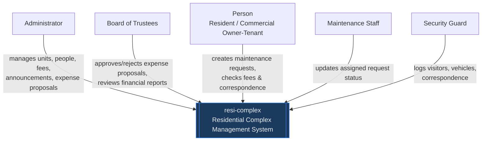
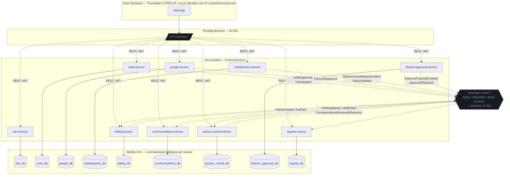

# System Architecture Overview — resi-complex

> This document is the technical snapshot of resi-complex's architecture. It translates the
> 9 Bounded Contexts identified in `02-domain/domain-map.md` into 9 deployable microservices.
> It is created after `02-domain/` and before `06-data/` and `07-api/`, and it guides the
> implementation of every service in `09-microservices/`.

---

## 1. Adopted architectural style

**Style:** Microservices, organized 1:1 around the 9 Bounded Contexts of `02-domain/domain-map.md`,
each internally structured with **Hexagonal Architecture** (see `hexagonal-architecture.md`), with
**Event-Driven** communication for cross-context propagation.

**Justification:**
- The domain was already decomposed into 9 independent Bounded Contexts, each with its own
  Ubiquitous Language, before this document existed (`02-domain/domain-map.md`) — microservices
  is the natural deployment unit for that decomposition, not a separate decision made in isolation.
- `02-domain/domain-events.md` already specifies 16 domain events, their consumers, and 6 reactive
  policies (e.g. "whenever `MaintenanceRequestCreated` arrives with `priority = URGENT`, notify
  maintenance staff immediately") — this is Event-Driven design that already exists on paper and
  needs an architecture to run on, not the other way around.
- `01-context/scope.md` locks the stack to Java + Spring Boot and MySQL, and the team's own stack
  guide (`_stacks/java-spring.md`) is written per-microservice with a dedicated hexagonal folder
  structure — the stack guide already assumes microservices.
- The Core Domain classification in `02-domain/domain-map.md` (Billing and Units Management as
  **Core**, IAM and Reports as **Generic**) only makes sense if investment can be allocated
  per-service — a modular monolith would not let the team invest disproportionately in Billing
  without also carrying that cost into IAM.

**Open gap:** no ADR currently records this decision formally — see `decisions/README.md`
(candidate `ADR-003`). This overview.md is the closest thing to a written justification today;
an ADR should still be created before `06-data/` is finalized, per `00-sdd-guide.md`'s review
gates ("Architecture Review — Does the architecture satisfy NFRs? — Tech Lead + Team").

**Reference ADR:** _Pending — `ADR-003-architectural-style.md` not yet written (see `decisions/README.md`)._

---

## 2. C4 Diagram — System Level (Context)

> Shows how the system fits in the world. External actors and external systems.
> Per `01-context/scope.md`, resi-complex has **no external third-party integrations** planned
> for the MVP (no payment gateway, no email/SMS provider, no external channel) — so the only
> actors at this level are the 5 authentication roles.

No external systems are integrated in this delivery (`01-context/scope.md`, "Included
integrations" table: "N/A — self-contained formative project"). Payment gateway and email/SMS
provider are explicitly out of scope and listed as future candidates only.

---

## 3. C4 Diagram — Container Level

> Shows the 9 services, their databases, and the two cross-cutting infrastructure pieces that
> are **not yet decided** (API Gateway, message broker) — shown dashed below, per the
> technical debt register in §8.

Event routing (which service publishes/consumes which topic) is already fully specified in
`02-domain/domain-events.md`'s event summary table — only the transport technology is open.

---

## 4. Service catalog

> Derived 1:1 from the 9 Bounded Contexts in `02-domain/domain-map.md`. **Port numbers are a
> proposal made in this document** (the source docs left them as `300X` placeholders) — they
> follow a simple sequential scheme and are **pending confirmation together with the final
> microservices catalog**, an open external dependency already tracked in `01-context/scope.md`
> ("Confirmation of the final microservices catalog — SENA instructor — 🟡 In progress").
> Database engine and dedication (MySQL, one per service) are **already stated**, not proposed,
> per `02-domain/domain-map.md`'s per-context table.

| # | Service | Responsibility | Port (proposed) | DB | Communication type |
|---|---------|---------------|------------------|-----|-------------------|
| 1 | `iam-service` | Authenticate users and resolve RBAC permissions for the 5 authentication roles (FR01) | 8081 | MySQL (dedicated) | REST (sync) — Open Host Service / Published Language upstream of all other services (JWT validation) |
| 2 | `units-service` | Register/edit/delete units; classify residential vs. commercial; register commercial establishment data (FR02–FR04) | 8082 | MySQL (dedicated) | REST (sync) + publishes `UnitRegistered`, `UnitUpdated`, `CommercialEstablishmentRegistered` (async) |
| 3 | `people-service` | Register residents and commercial owners/tenants; link them to a unit (FR01, `Person` subtype) | 8083 | MySQL (dedicated) | REST (sync) + publishes `PersonRegistered` (async) |
| 4 | `maintenance-service` | Manage the maintenance request lifecycle: create, assign, track status (FR05–FR06) | 8084 | MySQL (dedicated) | REST (sync) + publishes `MaintenanceRequestCreated`, `MaintenanceRequestStatusUpdated` (async) |
| 5 | `billing-service` | Generate monthly administration fees with rates differentiated by unit type; track payment status (FR08–FR10) — **Core Domain** | 8085 | MySQL (dedicated) | REST (sync) + consumes `UnitRegistered`/`UnitUpdated`; publishes `FeeGenerated`, `FeePaid` (async) |
| 6 | `communications-service` | Publish announcements segmented by unit scope; react to events to notify users in-app (FR07, FR11) | 8086 | MySQL (dedicated) | REST (sync) + consumes `MaintenanceRequestCreated/StatusUpdated`, `FeeGenerated`, `CorrespondenceReceived`, `ExpenseProposalCreated/Approved/Rejected`; publishes `AnnouncementPublished` (async) |
| 7 | `access-control-service` | Log visitor/vehicle entry-exit and incoming correspondence per unit (FR12–FR16) | 8087 | MySQL (dedicated) | REST (sync) + publishes `VisitRegistered`, `VisitEnded`, `CorrespondenceReceived`, `CorrespondenceDelivered` (async) |
| 8 | `finance-approval-service` | Manage extraordinary expense proposals and the Board of Trustees' permanent approval history (FR17–FR18) | 8088 | MySQL (dedicated) | REST (sync) + publishes `ExpenseProposalCreated`, `ExpenseProposalApproved`, `ExpenseProposalRejected` (async) |
| 9 | `reports-service` | Consolidate read-only, event-built projections: requests by status, pending fee arrears (FR19) — **Generic** | 8089 | MySQL (dedicated — read/projection model) | Async only — consumes events from all other contexts; exposes REST read endpoints (`reports:read`) |

Core / Supporting / Generic classification (Billing + Units = Core; IAM + Reports = Generic; the
rest Supporting) is already decided in `02-domain/domain-map.md` §4 and is not repeated here —
it is referenced because it should drive where the team over-invests in testing and design review
(e.g. `AdministrationFee`'s invariants deserve the most scrutiny of any aggregate in the system).

> Full per-service detail (endpoints, data model, runbook) belongs in
> `09-microservices/service-catalog.md`, which per `02-domain/README.md` is "still generic
> (`api-gateway`/`auth-service` examples, Node.js/PostgreSQL)" and needs updating with this table.

---

## 5. Architectural principles

These principles guide resi-complex's technical decisions. Before making an important decision,
verify it is consistent with these principles.

### P1: API-First
Design the API contract (OpenAPI) before implementing each service. Contracts are the source of
truth for consumers. Per `00-sdd-guide.md`'s recommended fill-in order, `07-api/contracts/openapi/`
is filled in the same week as this document (Week 2–3, item 14: "API contracts (contract-first)"),
immediately after the data model per service.

### P2: Database per Service
Each of the 9 services has its own MySQL database. No service directly accesses another
service's database. Communication is always through REST or domain events. This is not a
proposal — it is already the standing decision in `02-domain/domain-map.md`'s per-context table
("Database: MySQL (dedicated)" for all 9 contexts); this principle simply names it explicitly at
the architecture level.

### P3: Fail Fast, Recover Gracefully
Detect errors early (validation at the edge, enforced by each aggregate's invariants —
`02-domain/entities-and-rules.md`). When an external service fails, use a Circuit Breaker to
prevent cascades. **Currently aspirational**: Circuit Breaker is not yet adopted (see
`pattern-guide.md`'s adoption table) because it depends on the still-open API Gateway and
message broker decisions (§8, AT-001/AT-002).

### P4: Observability by Design
From day 1: structured JSON logs with correlation IDs, metrics with Prometheus, distributed
traces with OpenTelemetry → Jaeger — as already specified in `04-requirements/non-functional.md`
NFR-005. Per that same NFR's priority matrix, none of this is validated in CI yet ("Not yet —
planned"), but the requirement itself is not optional or a story for "later."

### P5: Ownership-Level Authorization by Default
Every service that exposes data scoped to a Person or a Unit must enforce **ownership-level
authorization** — restricting a Person to data belonging to their own Unit(s), beyond plain
role-based checks — at the service layer, not only via RBAC. This is `01-context/glossary.md`'s
own definition, already given a name (`:own` / `:assigned` permission suffixes in
`00-governance/security-policy.md`) and already applied consistently across
`fees:read:own` (billing), `requests:read:own` / `requests:read:assigned` (maintenance), and
`correspondence:read:own` (access control) in `02-domain/entities-and-rules.md`. It is promoted
here to an explicit architectural principle because it is not an incidental detail of three
services — it is a project-wide contract every new endpoint must satisfy.

---

## 6. Adopted architectural patterns

| Pattern | Adopted | Reference |
|---------|---------|-----------|
| API Gateway | **Pending decision** — AT-001 | `pattern-guide.md` |
| Database per Service | **Yes** | P2 above; `02-domain/domain-map.md` |
| CQRS | Partial / implicit for `reports-service` only | `pattern-guide.md` |
| Event Sourcing | No | `pattern-guide.md` |
| Circuit Breaker | **Deferred** — depends on AT-001/AT-002 | `pattern-guide.md` |
| Saga (choreographed) | Not needed yet — current cross-context flows are event + policy reactions, not multi-step compensating transactions (`02-domain/domain-events.md` "Policies") | `pattern-guide.md` |
| Outbox Pattern | **Recommended, not yet implemented** — `02-domain/domain-events.md`'s resilience section already requires at-least-once delivery + idempotent consumers, which the Outbox pattern is designed to guarantee | `pattern-guide.md` |

Full rationale for each row is in `pattern-guide.md`'s "Patterns adopted in this project" table.

---

## 7. Cross-cutting concerns

Transversal concerns that apply to ALL 9 services:

| Concern | Adopted solution | Status |
|---------|----------------|--------|
| Authentication / Authorization | JWT (1h expiration, 7-day refresh) issued by `iam-service`, validated by each service; RBAC per `00-governance/security-policy.md` | Validation currently assumed **local to each service** — centralizing it at an API Gateway is AT-001 |
| Ownership-level authorization | `:own` / `:assigned` permission suffixes, enforced at the service layer (P5 above) | Designed (`entities-and-rules.md`); not yet implemented (no code exists per `01-context/overview.md`, "implementation not started") |
| Logging | Structured JSON + Correlation ID | Planned — NFR-005, not yet validated in CI |
| Tracing | OpenTelemetry → Jaeger | Planned — NFR-005, not yet validated in CI |
| Health Checks | `GET /health` (liveness) + `GET /health/ready` (readiness) | Specified in NFR-002; not yet implemented |
| Error format | Standard `ErrorResponse` schema | **Not yet defined** — AT-004; belongs in `07-api/contracts/openapi/_shared.yaml` |
| Rate Limiting | At the API Gateway | Blocked by AT-001 |
| CORS | At the API Gateway | Blocked by AT-001 |
| Circuit Breaker | Resilience4j (Spring-native choice, given the locked Java + Spring Boot stack) | Deferred — see §6 |

---

## 8. Registered architectural technical debt

| ID | Description | Impact | Priority | Target sprint |
|----|-------------|--------|---------|--------------|
| AT-001 | No API Gateway defined yet — auth validation, rate limiting, and CORS are currently assumed per-service instead of centralized | Medium — every service currently duplicates JWT validation logic | P2 | Before the first multi-service integration demo (Sprint 3, `03-product/vision.md` H2) |
| AT-002 | Message broker technology not selected (Kafka vs. RabbitMQ vs. Redis Streams), even though all 16 domain events are already fully specified in `02-domain/domain-events.md` | High — blocks every async flow in H2 (Maintenance, Billing, Access Control all depend on published events) | P1 | Before Sprint 3, ahead of `billing-service`'s `FeeGenerated` and `maintenance-service`'s `MaintenanceRequestCreated` going live |
| AT-003 | Container orchestration platform undecided (`01-context/overview.md` marks Infrastructure "Pending definition") | Low for this formative delivery — only the Local environment is confirmed (`01-context/scope.md`) | P3 | Post-formative — Staging/Production are explicitly "not yet planned for the formative scope" |
| AT-004 | Standard error response schema (`07-api/contracts/openapi/_shared.yaml`) not yet defined | Medium — every service will otherwise invent its own error shape | P2 | Before the first OpenAPI contract is written (`00-sdd-guide.md` Week 2–3, item 14) |

> See also: `15-project-control/technical-backlog.md` (not yet created).

---

## 9. Planned evolution

| Version | Architectural change | Motivation | Estimated date |
|---------|---------------------|------------|----------------|
| v2.0 | Multi-property management (same system, many complexes) — would require revisiting P2's per-service isolation to add tenant scoping | Candidate future line, explicitly out of MVP scope (`01-context/scope.md`, `_template-scope-declaration.md` "Version 2") | Not scheduled |
| v2.0 | Payment gateway integration (Stripe, PayU) — new secondary adapter in `billing-service`, no domain change needed since `AdministrationFee.registerPayment()` already models the state transition | Candidate future line, explicitly out of MVP scope | Not scheduled |
| v3.0 | SaaS licensing model / API for third-party integrations | Candidate future line | Not scheduled |

---

## Key correlations

- Domain bounded contexts → `02-domain/domain-map.md`
- Domain events feeding the container diagram's async edges → `02-domain/domain-events.md`
- Specific decision ADRs → `05-architecture/decisions/`
- Hexagonal architecture per service → `05-architecture/hexagonal-architecture.md`
- Applied patterns → `05-architecture/pattern-guide.md`
- Per-service detail (still needs updating) → `09-microservices/service-catalog.md`
- UML diagrams (still needs updating) → `08-uml/`
- Locked technology stack → `01-context/overview.md`, `_stacks/java-spring.md`

