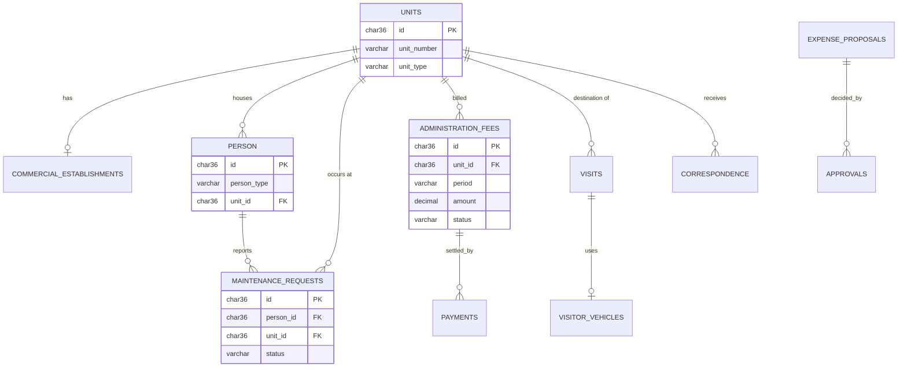

# Data Models per Service

> Data schema for each of resi-complex's 9 microservices. Each service has its own section
> and its own database (Database per Service, per `05-architecture/`). Schema changes are
> always done with versioned migrations, never by modifying tables in place.

> **DB engine:** MySQL 8 for all 9 services, per `01-context/scope.md` (Constraints → Technology)
> and confirmed per-service in `02-domain/domain-map.md`. `reports-service` uses MySQL as a
> read/projection store (no writes from users, only consumed events). No document or key-value
> store is used in this MVP scope.
> UUIDs are stored as `CHAR(36)`; MySQL has no native `TIMESTAMPTZ`, so all timestamps are
> `TIMESTAMP` in UTC (the application layer applies timezone at the edge).

---

## Data modeling principles

### 1. Database per Service (mandatory)
No service directly accesses another service's database (e.g. `billing-service` never
JOINs against `units-service` tables). Cross-service data is obtained via API call
(sync) or Domain Event (async) — see `02-domain/domain-events.md`.

```
✓ iam-service       → iam_db          (MySQL)
✓ billing-service   → billing_db      (MySQL)
✗ billing-service   → JOIN units_db.units
```

### 2. Standard audit fields
All tables include:

```sql
id          CHAR(36)    PRIMARY KEY,          -- UUID, generated in application code
created_at  TIMESTAMP   NOT NULL DEFAULT CURRENT_TIMESTAMP,
updated_at  TIMESTAMP   NOT NULL DEFAULT CURRENT_TIMESTAMP ON UPDATE CURRENT_TIMESTAMP,
deleted_at  TIMESTAMP   NULL                   -- NULL = active (soft delete)
```

### 3. Soft delete by default
Do not delete records with a physical DELETE. Use `deleted_at IS NOT NULL` to mark as deleted.
This facilitates auditing and recovery.

### 4. Naming conventions

```sql
-- Tables:      snake_case, plural              → orders, order_items, users
-- Columns:     snake_case, descriptive         → unit_price, delivery_date
-- FKs:         [referenced_table]_id           → customer_id, product_id
-- Indexes:     idx_[table]_[column(s)]         → idx_orders_customer_id
-- Timestamps:  always with timezone (TIMESTAMPTZ, not TIMESTAMP)
```

---

## Service: `auth-service`

**DB Engine:** MySQL 8 — ACID transactions for credential/session integrity; relational
fit for a small, well-defined schema (users, roles, sessions).

### Table: `users`

**Purpose:** One authentication account per person using the system (`FR01`).

```sql
CREATE TABLE users (
  id              CHAR(36)     PRIMARY KEY,
  email           VARCHAR(255) NOT NULL,
  password_hash   VARCHAR(255) NOT NULL,      -- BCrypt, per security-policy.md
  role            VARCHAR(20)  NOT NULL
                  CHECK (role IN ('ADMINISTRATOR','BOARD','PERSON','MAINTENANCE_STAFF','SECURITY_GUARD')),
  person_id       CHAR(36)     NULL,           -- FK to people-service, table `person`; NULL for staff roles
  status          VARCHAR(20)  NOT NULL DEFAULT 'ACTIVE'
                  CHECK (status IN ('ACTIVE','INACTIVE')),

  created_at      TIMESTAMP    NOT NULL DEFAULT CURRENT_TIMESTAMP,
  updated_at      TIMESTAMP    NOT NULL DEFAULT CURRENT_TIMESTAMP ON UPDATE CURRENT_TIMESTAMP,
  deleted_at      TIMESTAMP    NULL,

  UNIQUE KEY uq_users_email (email)
);

CREATE INDEX idx_users_role ON users (role);
CREATE INDEX idx_users_deleted ON users (deleted_at);
```

**Data dictionary:**

| Column | Type | Description |
|--------|------|-------------|
| role | VARCHAR(20) | One of the 5 authentication roles (`00-governance/security-policy.md`) — a user has exactly one |
| person_id | CHAR(36) | Cross-service reference to `people-service.person.id`, resolved via API, not a DB-level FK |

**Modeling decisions:**
1. `person_id` is a **logical** reference, not an enforced FK — Database per Service forbids cross-DB constraints; `iam-service` validates it via API call at registration time.
2. No `Session` table: sessions are stateless JWTs (`00-governance/security-policy.md`); only `refresh_token` needs persistence for rotation/revocation (table `refresh_tokens`, out of MVP detail here).

---

## Service: `units-service`

**DB Engine:** MySQL 8 — relational fit; strict 1:1 `unit` ↔ optional `commercial_establishment`.

### Table: `units`

**Purpose:** A physical space in the complex, residential or commercial (`FR02`–`FR04`).

```sql
CREATE TABLE units (
  id              CHAR(36)     PRIMARY KEY,
  unit_number     VARCHAR(20)  NOT NULL,       -- e.g. "Apto 301", "Local 5"
  unit_type       VARCHAR(20)  NOT NULL
                  CHECK (unit_type IN ('RESIDENTIAL','COMMERCIAL')),

  created_at      TIMESTAMP    NOT NULL DEFAULT CURRENT_TIMESTAMP,
  updated_at      TIMESTAMP    NOT NULL DEFAULT CURRENT_TIMESTAMP ON UPDATE CURRENT_TIMESTAMP,
  deleted_at      TIMESTAMP    NULL,

  UNIQUE KEY uq_units_number (unit_number)
);

CREATE INDEX idx_units_type ON units (unit_type);
```

### Table: `commercial_establishments`

```sql
CREATE TABLE commercial_establishments (
  id              CHAR(36)     PRIMARY KEY,
  unit_id         CHAR(36)     NOT NULL UNIQUE
                  REFERENCES units(id) ON DELETE RESTRICT,
  business_name   VARCHAR(150) NOT NULL,
  business_type   VARCHAR(100) NOT NULL,
  opening_time    TIME         NOT NULL,
  closing_time    TIME         NOT NULL,

  created_at      TIMESTAMP    NOT NULL DEFAULT CURRENT_TIMESTAMP,
  updated_at      TIMESTAMP    NOT NULL DEFAULT CURRENT_TIMESTAMP ON UPDATE CURRENT_TIMESTAMP
);
```

**Modeling decisions:**
1. `commercial_establishments.unit_id` is `UNIQUE` — enforces the glossary rule "a commercial Unit *has* an Establishment, it is not the same record" as a 1:1, not 1:N.
2. A row here can only exist if the referenced unit is `COMMERCIAL` — enforced in the application layer (MySQL `CHECK` cannot reference another table).

---

## Service: `people-service`

### Table: `person`

**Purpose:** A Resident or Commercial Owner/Tenant, per the glossary's single-entity rule (`FR01`).

```sql
CREATE TABLE person (
  id              CHAR(36)     PRIMARY KEY,
  full_name       VARCHAR(150) NOT NULL,
  document_id     VARCHAR(30)  NOT NULL,
  person_type     VARCHAR(20)  NOT NULL
                  CHECK (person_type IN ('RESIDENT','COMMERCIAL_OWNER','COMMERCIAL_TENANT')),
  unit_id         CHAR(36)     NOT NULL,        -- logical ref → units-service.units.id
  phone           VARCHAR(20)  NULL,
  email           VARCHAR(255) NULL,

  created_at      TIMESTAMP    NOT NULL DEFAULT CURRENT_TIMESTAMP,
  updated_at      TIMESTAMP    NOT NULL DEFAULT CURRENT_TIMESTAMP ON UPDATE CURRENT_TIMESTAMP,
  deleted_at      TIMESTAMP    NULL,

  UNIQUE KEY uq_person_document (document_id)
);

CREATE INDEX idx_person_unit_id ON person (unit_id);
```

**Modeling decisions:**
1. Single table `person` with `person_type`, per glossary: "Do NOT model Resident and Owner/Tenant as separate authentication roles."
2. `unit_id` is a logical reference to `units-service`, validated via API on create.

---

## Service: `maintenance-service`

### Table: `maintenance_requests`

**Purpose:** Ticket reported by a Person, tracked through a status lifecycle (`FR05`–`FR07`).
Full attribute rationale and invariants already specified in
`02-domain/entities-and-rules.md` (Entity: MaintenanceRequest) — this table is its direct
persistence mapping.

```sql
CREATE TABLE maintenance_requests (
  id              CHAR(36)     PRIMARY KEY,
  person_id       CHAR(36)     NOT NULL,       -- logical ref → people-service (table `person`)
  unit_id         CHAR(36)     NOT NULL,       -- logical ref → units-service
  type            VARCHAR(50)  NOT NULL,       -- controlled list, see Data Dictionary
  description     VARCHAR(500) NOT NULL,
  priority        VARCHAR(10)  NOT NULL
                  CHECK (priority IN ('LOW','MEDIUM','HIGH','URGENT')),
  assigned_to     CHAR(36)     NULL,           -- logical ref → iam-service user (MAINTENANCE_STAFF)
  status          VARCHAR(20)  NOT NULL DEFAULT 'PENDING'
                  CHECK (status IN ('PENDING','ASSIGNED','IN_PROGRESS','RESOLVED')),

  created_at      TIMESTAMP    NOT NULL DEFAULT CURRENT_TIMESTAMP,
  updated_at      TIMESTAMP    NOT NULL DEFAULT CURRENT_TIMESTAMP ON UPDATE CURRENT_TIMESTAMP
);

CREATE INDEX idx_maintreq_person_id ON maintenance_requests (person_id);
CREATE INDEX idx_maintreq_status ON maintenance_requests (status);
CREATE INDEX idx_maintreq_assigned_to ON maintenance_requests (assigned_to);
```

> `evidencePhotoUrls` (future candidate per `02-domain/entities-and-rules.md`) is
> intentionally **not** a column yet — add only once the team confirms the feature.

---

## Service: `billing-service`

### Table: `administration_fees`

**Purpose:** Monthly charge per Unit, rate differentiated by unit type (`FR08`–`FR10`).
Direct mapping of Entity: AdministrationFee (`02-domain/entities-and-rules.md`).

```sql
CREATE TABLE administration_fees (
  id                        CHAR(36)      PRIMARY KEY,
  unit_id                   CHAR(36)      NOT NULL,   -- logical ref → units-service
  period                    CHAR(7)       NOT NULL,   -- format YYYY-MM
  unit_type_at_generation   VARCHAR(20)   NOT NULL
                            CHECK (unit_type_at_generation IN ('RESIDENTIAL','COMMERCIAL')),
  amount                    DECIMAL(12,2) NOT NULL,   -- Money VO; currency fixed to COP
  due_date                  DATE          NOT NULL,
  status                    VARCHAR(20)   NOT NULL DEFAULT 'PENDING'
                            CHECK (status IN ('PENDING','PAID','OVERDUE')),

  created_at                TIMESTAMP     NOT NULL DEFAULT CURRENT_TIMESTAMP,
  updated_at                TIMESTAMP     NOT NULL DEFAULT CURRENT_TIMESTAMP ON UPDATE CURRENT_TIMESTAMP,

  CHECK (amount > 0),
  UNIQUE KEY uq_fee_unit_period (unit_id, period)
);

CREATE INDEX idx_fees_status ON administration_fees (status);
CREATE INDEX idx_fees_unit_id ON administration_fees (unit_id);
```

### Table: `payments`

```sql
CREATE TABLE payments (
  id              CHAR(36)      PRIMARY KEY,
  fee_id          CHAR(36)      NOT NULL REFERENCES administration_fees(id) ON DELETE RESTRICT,
  amount_paid     DECIMAL(12,2) NOT NULL,
  paid_at         TIMESTAMP     NOT NULL DEFAULT CURRENT_TIMESTAMP,

  CHECK (amount_paid > 0)
);

CREATE INDEX idx_payments_fee_id ON payments (fee_id);
```

**Modeling decisions:**
1. `unit_type_at_generation` is copied and never recalculated (INV-002 in `entities-and-rules.md`) — no trigger syncs it from `units-service`.
2. `UNIQUE (unit_id, period)` prevents generating two fees for the same unit in the same month — an invariant not stated explicitly in `02-domain/` but implied by "monthly charge"; confirm with the team before relying on it.

---

## Service: `communications-service`

### Table: `announcements`

**Purpose:** Message segmented by unit scope (`FR11`).

```sql
CREATE TABLE announcements (
  id              CHAR(36)     PRIMARY KEY,
  title           VARCHAR(150) NOT NULL,
  body            TEXT         NOT NULL,
  scope           VARCHAR(20)  NOT NULL
                  CHECK (scope IN ('ALL','RESIDENTIAL_ONLY','COMMERCIAL_ONLY')),
  published_by    CHAR(36)     NOT NULL,       -- logical ref → iam-service (ADMINISTRATOR)

  created_at      TIMESTAMP    NOT NULL DEFAULT CURRENT_TIMESTAMP,
  updated_at      TIMESTAMP    NOT NULL DEFAULT CURRENT_TIMESTAMP ON UPDATE CURRENT_TIMESTAMP
);

CREATE INDEX idx_announcements_scope ON announcements (scope);
```

---

## Service: `access-control-service`

**DB Engine:** MySQL 8 — owns three related tables (visits, vehicles, correspondence),
per bounded context "Access Control" (`FR12`–`FR16`).

### Table: `visits`

```sql
CREATE TABLE visits (
  id              CHAR(36)     PRIMARY KEY,
  unit_id         CHAR(36)     NOT NULL,        -- logical ref → units-service
  visitor_name    VARCHAR(150) NOT NULL,
  visitor_type    VARCHAR(20)  NOT NULL
                  CHECK (visitor_type IN ('PERSONAL','COMMERCIAL_CLIENT')),
  logged_by       CHAR(36)     NOT NULL,        -- logical ref → iam-service (SECURITY_GUARD)
  entry_at        TIMESTAMP    NOT NULL DEFAULT CURRENT_TIMESTAMP,
  exit_at         TIMESTAMP    NULL
);

CREATE INDEX idx_visits_unit_id ON visits (unit_id);
```

### Table: `visitor_vehicles`

```sql
CREATE TABLE visitor_vehicles (
  id              CHAR(36)     PRIMARY KEY,
  visit_id        CHAR(36)     NOT NULL REFERENCES visits(id) ON DELETE CASCADE,
  plate_number    VARCHAR(15)  NOT NULL,
  vehicle_type    VARCHAR(20)  NOT NULL
);

CREATE INDEX idx_vehicles_visit_id ON visitor_vehicles (visit_id);
```

### Table: `correspondence`

**Purpose:** Direct mapping of Entity: Correspondence (`02-domain/entities-and-rules.md`).

```sql
CREATE TABLE correspondence (
  id              CHAR(36)     PRIMARY KEY,
  unit_id         CHAR(36)     NOT NULL,        -- logical ref → units-service
  description     VARCHAR(200) NULL,
  logged_by       CHAR(36)     NOT NULL,        -- logical ref → iam-service (SECURITY_GUARD)
  status          VARCHAR(20)  NOT NULL DEFAULT 'PENDING'
                  CHECK (status IN ('PENDING','DELIVERED')),
  received_at     TIMESTAMP    NOT NULL DEFAULT CURRENT_TIMESTAMP,
  delivered_at    TIMESTAMP    NULL
);

CREATE INDEX idx_correspondence_unit_id ON correspondence (unit_id);
CREATE INDEX idx_correspondence_status ON correspondence (status);
```

---

## Service: `finance-approval-service`

### Table: `expense_proposals`

**Purpose:** Extraordinary expense submitted for Board approval (`FR17`–`FR18`).

```sql
CREATE TABLE expense_proposals (
  id              CHAR(36)      PRIMARY KEY,
  title           VARCHAR(150)  NOT NULL,
  description     TEXT          NOT NULL,
  amount          DECIMAL(12,2) NOT NULL,
  created_by      CHAR(36)      NOT NULL,       -- logical ref → iam-service (ADMINISTRATOR)
  status          VARCHAR(20)   NOT NULL DEFAULT 'PENDING'
                  CHECK (status IN ('PENDING','APPROVED','REJECTED')),

  created_at      TIMESTAMP     NOT NULL DEFAULT CURRENT_TIMESTAMP,
  updated_at      TIMESTAMP     NOT NULL DEFAULT CURRENT_TIMESTAMP ON UPDATE CURRENT_TIMESTAMP,

  CHECK (amount > 0)
);
```

### Table: `approvals`

**Purpose:** Append-only decision record — glossary: "Do not overwrite — approvals are
append-only for traceability."

```sql
CREATE TABLE approvals (
  id                CHAR(36)     PRIMARY KEY,
  expense_proposal_id CHAR(36)   NOT NULL REFERENCES expense_proposals(id) ON DELETE RESTRICT,
  decided_by        CHAR(36)     NOT NULL,      -- logical ref → iam-service (BOARD)
  decision          VARCHAR(10)  NOT NULL CHECK (decision IN ('APPROVED','REJECTED')),
  decided_at        TIMESTAMP    NOT NULL DEFAULT CURRENT_TIMESTAMP
  -- No updated_at / no UPDATE or DELETE grants at the app layer: append-only by design
);

CREATE INDEX idx_approvals_proposal_id ON approvals (expense_proposal_id);
```

---

## Service: `reports-service`

**DB Engine:** MySQL 8, used purely as a **read/projection store** — no user-facing writes.
Tables are populated by consuming Domain Events from the other 8 services
(`02-domain/domain-events.md`), not by direct API calls (`FR19`).

### Table: `requests_by_status_view`

```sql
CREATE TABLE requests_by_status_view (
  status          VARCHAR(20)  PRIMARY KEY,
  request_count   INT          NOT NULL DEFAULT 0,
  last_updated_at TIMESTAMP    NOT NULL DEFAULT CURRENT_TIMESTAMP ON UPDATE CURRENT_TIMESTAMP
);
```

### Table: `pending_fees_view`

```sql
CREATE TABLE pending_fees_view (
  unit_id           CHAR(36)      PRIMARY KEY,
  total_pending     DECIMAL(12,2) NOT NULL DEFAULT 0,
  oldest_overdue_at DATE          NULL,
  last_updated_at   TIMESTAMP     NOT NULL DEFAULT CURRENT_TIMESTAMP ON UPDATE CURRENT_TIMESTAMP
);
```

**Modeling decisions:**
1. Denormalized on purpose (one row per status / per unit) — these are read models, not
   the source of truth; see `normalization-assessment.md` (pending) for the justification pattern to follow.
2. Updated via event consumers (e.g. `MaintenanceRequestStatusUpdatedEvent`, `FeePaidEvent` — see `02-domain/domain-events.md`), never by a direct client write.

---

## Migration strategy

**Tool:** Flyway, per `_stacks/java-spring.md` and `10-devops/local-setup.md`
("Java + Flyway → `mvn flyway:migrate`"). Each of the 9 services owns its own
`src/main/resources/db/migration/` folder — migrations never span services.

**File naming convention:**

```
V{version_number}__{snake_case_description}.sql

Examples (billing-service):
  V001__create_administration_fees_table.sql
  V002__create_payments_table.sql
  V003__add_unique_fee_unit_period.sql
```

**Migration rules:**

```
✓ Migrations are ALWAYS forward-only
✓ One migration per logical change
✓ Seed data goes in separate migrations with prefix S: S001__seed_...
✗ Never modify a migration already executed in any environment
✗ Never do DROP COLUMN / DROP TABLE in a migration if there is code in production that uses it
    (process: 1-deprecate in code → 2-cleanup migration in the next release)
```

**Compatible schema changes (non-breaking):**

```sql
-- Add nullable column → always safe
ALTER TABLE maintenance_requests ADD COLUMN notes TEXT;

-- Add NOT NULL column with DEFAULT → safe if DEFAULT is valid
ALTER TABLE administration_fees ADD COLUMN late_fee_applied BOOLEAN NOT NULL DEFAULT FALSE;

-- Create new index → safe; MySQL locks the table briefly unless using ALGORITHM=INPLACE
CREATE INDEX idx_fees_due_date ON administration_fees (due_date);
```

**Incompatible changes (require 2-phase migration):**

```sql
-- Rename column → 2 phases:
-- Phase 1 (release N): Add new column, copy data, update code to use both
ALTER TABLE person ADD COLUMN full_legal_name VARCHAR(150);
UPDATE person SET full_legal_name = full_name;

-- Phase 2 (release N+1): Remove old column (code no longer uses it)
ALTER TABLE person DROP COLUMN full_name;
```

---

## DB engine selection guide

Recorded for context — resi-complex has already standardized on MySQL 8 for all 9
services (`01-context/scope.md`), so this table exists only to justify why the
alternatives were **not** chosen for this project's MVP:

| Engine | Use when... | Why not chosen here |
|--------|------------|---------------------|
| **MySQL (chosen)** | ACID transactions, well-defined relational schema, team's confirmed stack | — |
| **MongoDB** | Flexible/nested documents, catalogs with variable shape | No entity in `02-domain/` needs a variable schema |
| **Redis** | Cache, sessions, lightweight queues | JWTs are stateless (`security-policy.md`); no caching layer in MVP scope |
| **Elasticsearch** | Full-text search, log analytics | No search requirement in `04-requirements/` |
| **InfluxDB / TimescaleDB** | Time series, IoT metrics | No telemetry/IoT entity in scope |

---

## Relationship diagram (per service)



> This diagram spans multiple services' tables for readability only — in reality every
> `FK` drawn across a service boundary (e.g. `person.unit_id` → `units.id`) is a
> **logical** reference resolved via API, never a real SQL foreign key, per Database per Service.

---

## Correlations

- Domain entities that map to these tables → `02-domain/entities-and-rules.md`
- Saga and Outbox pattern for distributed consistency → `05-architecture/pattern-guide.md`
- Data for each service in detail → `09-microservices/services/XX/data-model.md`
- How data is accessed via API → `07-api/contracts/openapi/`
